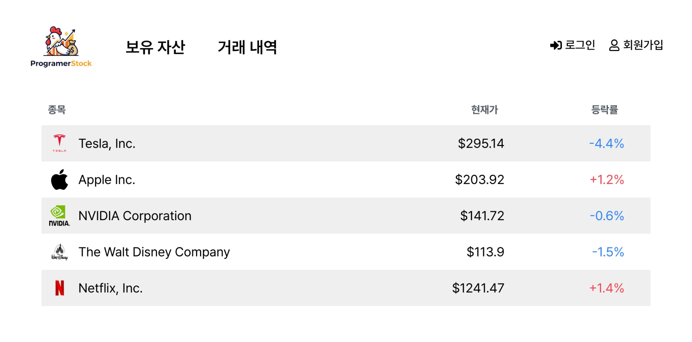
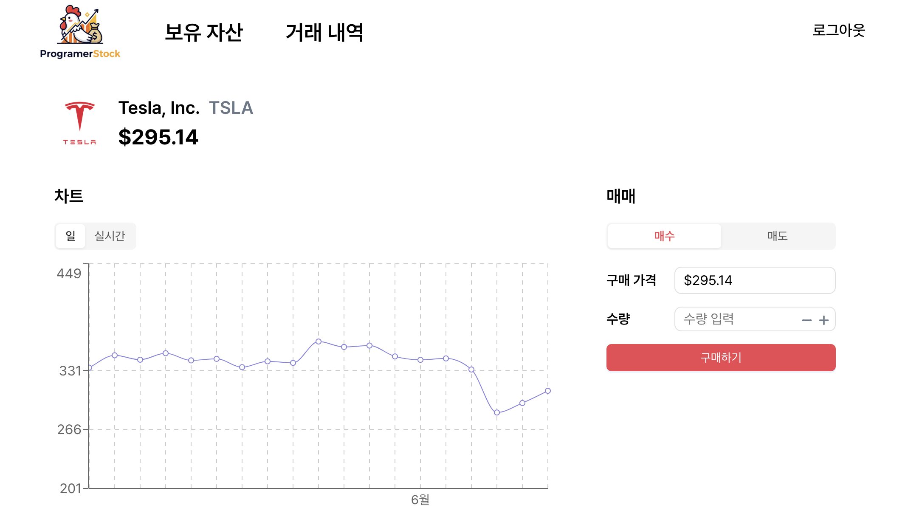
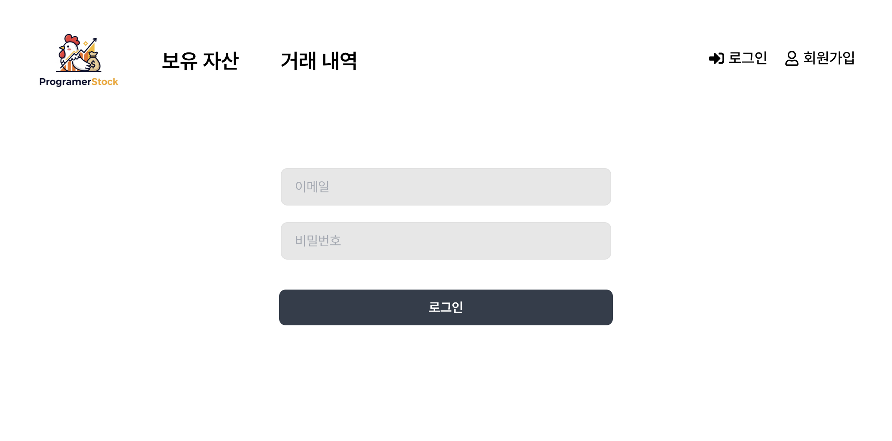
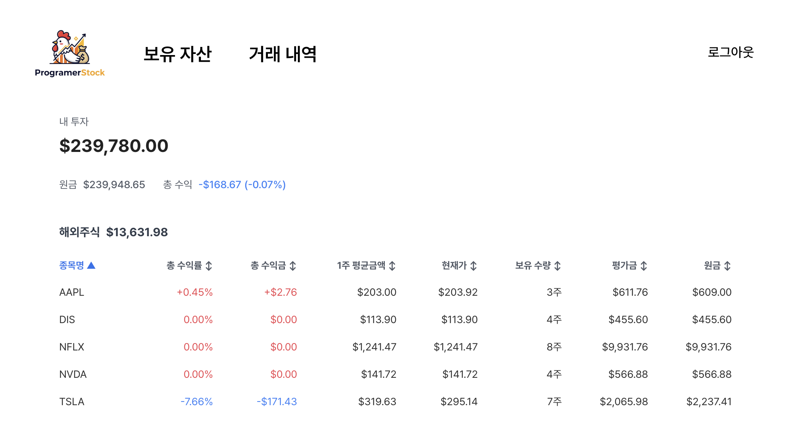
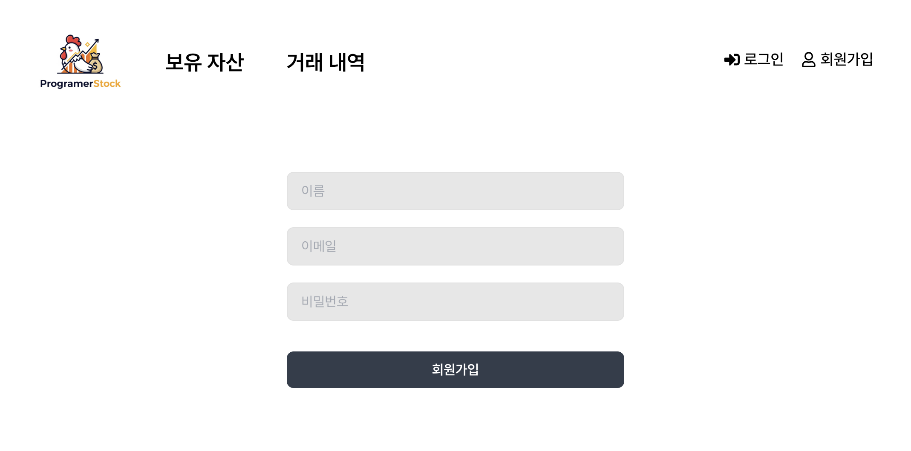
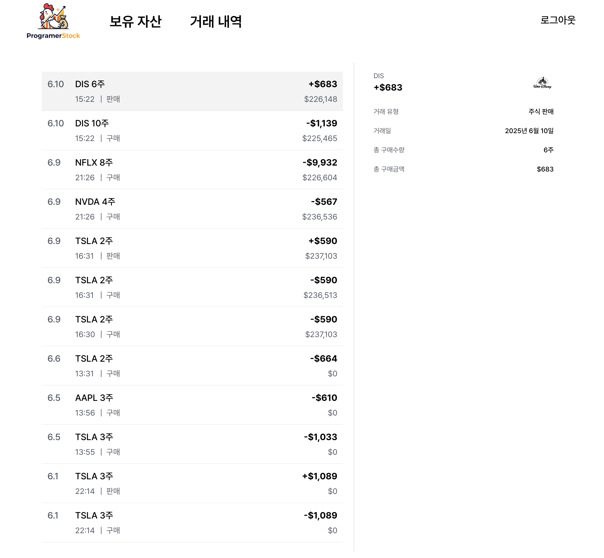

# ProgramerStocks - 모의 주식 투자 웹 서비스

> 실제 주식 거래처럼! 실시간 가격 변동을 반영한 종목 매수/매도 시뮬레이션 웹 서비스

---

## 프로젝트 개요

| 항목       | 내용                                     |
| ---------- | ---------------------------------------- |
| 프로젝트명 | ProgramerStocks                          |
| 개발 기간  | 2025.05.20 ~ 2025.06.11                 |
| 팀 구성    | 4인 팀 프로젝트 (프론트엔드 2, 백엔드 2) |
| 내 역할    | 백엔드 API 개발 및 서버 배포             |

---

## 기술 스택

### 프론트엔드

- React + TypeScript
- styled-components
- Zustand (상태관리)
- Recharts (차트 시각화)
- react-hook-form (폼 유효성 검사)

### 백엔드

- Node.js + Express
- MySQL
- JWT (인증)
- Axios + Alpha Vantage API
- AWS EC2 + Nginx + PM2 (서버 배포)

---

## 주요 기능

### 홈 (주식 종목 리스트)

- 대표 종목 5개 테이블로 표시
- 등락률 시각적 표시 (색상 + 기호)
- 종목 클릭 시 상세 페이지 이동

### 종목 상세 페이지

- Recharts 기반 실시간 & 일별 차트 제공
- 매수/매도 기능 (버튼 및 수량 입력 지원)

### 거래 내역

- 일시, 종목, 수량, 유형, 금액 확인
- 항목 클릭 시 우측 상세 정보 출력 (종목 로고 포함)

### 보유 자산

- 총 자산/수익률 요약 및 종목별 수익률 표시
- 컬럼 클릭 시 정렬 기능

### 로그인 / 회원가입

- react-hook-form 기반 유효성 검사
- 성공/실패 여부에 따른 알림 처리

---

## 내 역할 - 백엔드

### 1. DB 설계 및 구축

- 도메인 기반 MySQL 테이블 직접 설계
- 정규화 및 관계 설정
  - ex) user - asset (1:1), user - transactions (1:N)

### 2. 주식 거래 API 개발

- 매수/매도/거래내역/자산 조회/주식 가격 확인 등 구현
- DB 트랜잭션으로 원자성 보장
- 유효성 검사: 현금 부족, 수량 부족 등

### 3. 실시간 주식 가격 캐싱 시스템

- Alpha Vantage API 이용, 가격 데이터 주기적 캐싱
- `stock_prices` 테이블 또는 메모리 저장 → API 호출 최소화

### 4. RESTful API 및 라우터 구조화

- `/stocks`, `/transactions`, `/assets`, `/users` 등 모듈화
- 라우터-컨트롤러-모델 구조화

### 5. JWT 인증 및 보안

- 로그인 시 JWT 토큰 발급, 인증된 요청만 처리
- bcrypt 비밀번호 해싱 및 인증 로직 구현

### 6. 서버 배포 및 운영

- AWS EC2 Ubuntu 인스턴스에 Express 앱 배포
- Nginx 리버스 프록시 및 PM2로 프로세스 관리

---

## Problems & Solutions (Detailed)

### 1\. **실시간 시세 API 호출 제한으로 인한 서비스 불안정**
   
**문제**: 초기에는 프론트에서 직접 Alpha Vantage API를 호출하도록 구현했지만, 무료 플랜 호출 제한 때문에 동시에 여러 사용자가 접속하면 API Limit 초과가 발생함.  
일부 종목 데이터가 누락되거나 화면에 undefined/null이 표시되었고, 조회 시 응답 속도도 느려짐. 특히 API 호출 실패 시 대체 데이터가 없어 서비스가 중단되는 문제가 존재.

**해결**:

  - 백엔드에서 주기적으로 데이터를 수집하고 DB에 캐싱하도록 구조 전환  
  - `node-cron`으로 한국 시간 기준 밤 11시, 1시, 3시, 5시에 가격 수집  
  - 종가 정보는 `daily_stock_prices`, 실시간 가격은 `stock_prices`에 저장  
  - 프론트는 항상 DB를 조회하도록 변경  

```js
// 시간별 가격 수집
cron.schedule("0 14,16,18,20 * * *", async () => { ... });

// 일별 가격 수집
cron.schedule("0 0 * * *", async () => { ... });
```

### 2\. **주식 자산 계산 시 데이터 불일치 문제**

**문제**: 사용자의 자산 조회 시 기준 가격이 명확하지 않아, 조회 시점마다 결과가 달라지거나 최신 가격을 가져오지 못해 수익률 계산 오류 발생.

**해결**:

  - 종목별 최신 `fetched_at` 시간을 서브쿼리로 조회하여 해당 시간의 가격만 JOIN.
  - 일관된 기준으로 자산 및 수익률 계산 로직 정립.

<!-- end list -->

```javascript
// 자산 가치 및 수익률 계산 로직 통일
const valuation = h.quantity * h.current_price;
const profit = valuation - h.quantity * h.average_price;
```

### 3\. 잘못된 요청으로 인한 데이터 무결성 위험

**문제**: 사용자가 `cash`나 `quantity`에 문자열, `null`, `undefined` 등 비정상적인 값을 전송할 경우 DB에 잘못된 데이터가 저장될 위험 존재.

**해결**:

  - 서버 진입점(Controller)에서 모든 중요한 값을 1차 검증.
  - 숫자가 아니거나 필수 값이 누락된 경우 즉시 400 에러 반환.

<!-- end list -->

```javascript
// 유효성 검사 예시
if (cash === undefined || isNaN(cash)) {
  return res.status(400).json({ error: "cash는 숫자여야 합니다" });
}
```

### 4\. 주식 등락률 계산 로직 부재

**문제**: 외부 API에서 등락률(%) 데이터를 제공하지 않음. 전일 종가(`daily_stock_prices`)와 실시간 가격(`stock_prices`)을 비교해야 하는데, 데이터가 없으면 계산 에러 발생.

**해결**:

  - 백엔드에서 전일 종가와 최신 가격을 안전하게 비교하는 유틸리티 함수 구현.
  - `change_rate`를 계산해서 응답 객체에 포함시켜 프론트 연산 부담 제거.

<!-- end list -->

```javascript
function calculateChangeRate(prevPrice, currPrice) {
  if (!prevPrice || !currPrice || prevPrice === 0) return null;
  // 소수점 첫째 자리까지 등락률 계산
  return parseFloat((((currPrice - prevPrice) / prevPrice) * 100).toFixed(1));
}
```

### 5\. 기능 증가로 인한 코드 복잡도 상승

**문제**: 자산 조회, 종목 조회, 가격 수집 등 기능이 하나의 파일에 섞이면서 유지보수성과 가독성 저하.

**해결**:

  - 각 기능을 명확히 분리하고 RESTful 구조 적용.
  - SQL 쿼리와 비즈니스 로직을 분리하여 확장성 확보.

<!-- end list -->

```javascript
// Controller 모듈화
exports.getStockList = ...
exports.getStockDetail = ...
exports.getMyAssets = ...
exports.updateCash = ...
```

### 6\. 수동 운영 → 자동화 시스템

**문제**: 초기에는 데이터를 수동으로 갱신해야 했기 때문에 실제 라이브 서비스 운영에는 부적합.

**해결**:

  - `cron` 기반 자동 수집 시스템을 구축하여 서버가 실행 중이면 자동으로 데이터 업데이트.
  - 실제 서비스 운영 환경과 유사한 자동화 구조 구현.

<br>

## 협업 방식

  - **GitHub Flow**: `main`(배포), `dev`(개발), `feature/#issue`(기능) 브랜치 전략 사용.
  - **Code Review**: Pull Request를 통한 코드 리뷰 진행 후 Merge.
  - **Commit Convention**: `feat`, `fix`, `chore`, `docs` 등 커밋 메시지 규칙 통일.

<br>

## 프로젝트를 통해 배운 점

  - **실시간 데이터 처리**: 주식 시장 데이터의 특성을 이해하고 캐싱 전략을 통해 API 제한을 극복하는 방법.
  - **데이터 무결성**: 백엔드 트랜잭션 처리(ACID)와 철저한 유효성 검사의 중요성.
  - **보안**: JWT를 이용한 인증 처리 및 사용자 정보 보호 설계.
  - **인프라**: AWS EC2 인스턴스에 서버를 배포하고 Nginx와 PM2로 운영하는 실무 경험.

<br/>

## 실행 화면

| 홈 화면 | 종목 상세 |
| :---: | :---: |
|  |  |
| **로그인** | **자산 현황** |
|  |  |
| **회원가입** | **거래 내역** |
|  |  |

<br/>

## 설치 및 실행 방법 (Installation)

```bash
# 1. Repository Clone
$ git clone [https://github.com/kevinmj12/stock-simulator.git](https://github.com/kevinmj12/stock-simulator.git)

# 2. Backend Setup
$ cd backend
$ npm install

# 3. Environment Configuration (.env)
MYSQL_HOST=...
MYSQL_USER=...
ALPHA_VANTAGE_API_KEY=...
JWT_SECRET=...

# 4. Server Start
$ npm start
```

<br>

## 마무리

이 프로젝트는 실시간 주식 시세와 트랜잭션 기반 매수/매도 시뮬레이션을 구현하며 **실제 서비스처럼 작동하는 구조**를 만드는 데 집중했습니다.

백엔드 전반을 구현하며 실무 감각을 익힐 수 있었고, **EC2 Instance 서버 배포 경험**을 통해 개발부터 배포까지의 전체 사이클을 경험할 수 있었습니다. 또한 팀원과의 소통 및 Git 기반 협업 경험도 큰 자산이 되었습니다.

-----

## 배포 주소 & GitHub

- GitHub: [https://github.com/kevinmj12/stock-simulator](https://github.com/kevinmj12/stock-simulator)

---


```
```
